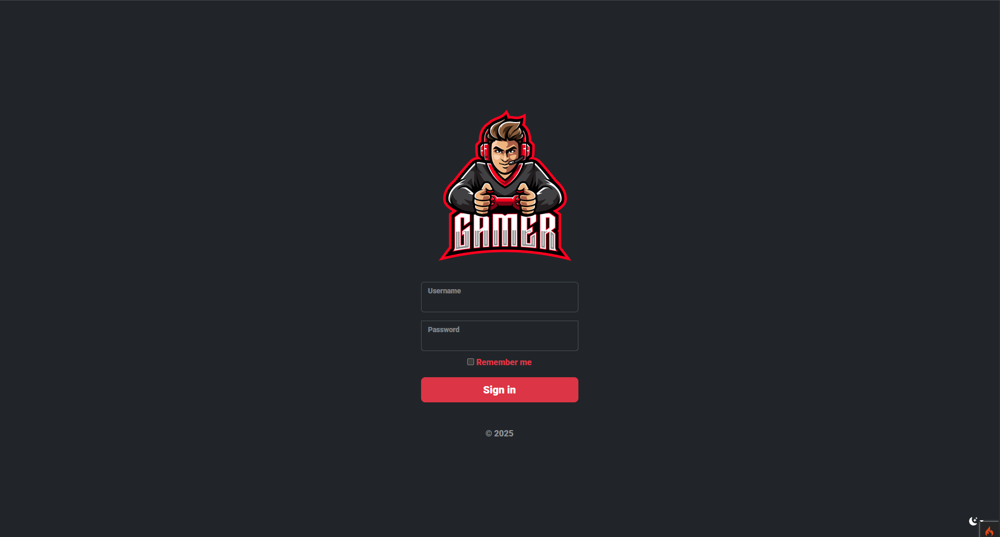
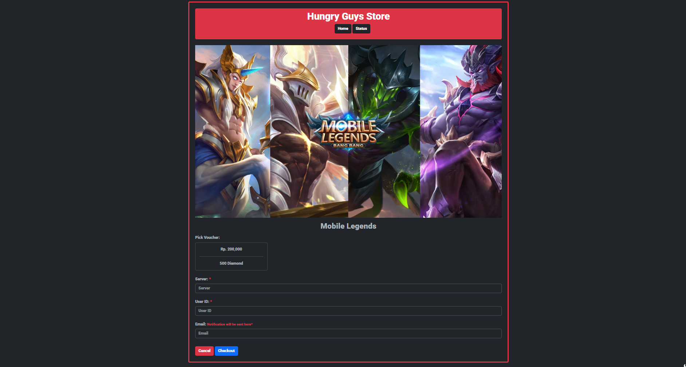

# 🎮 Hungry Guys Store

Hungry Guys Store is a game voucher storefront built with CodeIgniter 4. Users can browse game products, and admins can manage orders, products, and send updates directly via WhatsApp.

## 📸 Screenshots

### 🔐 Admin Login



> Secure login page for administrators to access the dashboard. Only authorized users can manage products and orders.

### 📊 Admin Dashboard


> The dashboard provides an overview of current stats, including active vouchers, orders, and a quick navigation to manage game data. It also includes integrated search and a responsive layout.

### 🛍️ Game Shop (User Side)


> This is the main store where users can browse game vouchers. Games like PUBG, Valorant, and Mobile Legends are showcased. Each game card allows users to select and purchase vouchers. Fully responsive and search-enabled.

---

### 🛍️ Checkout page



> This is the main page where users can browse purchase game vouchers and can be managed from administrator dashboard

---

## 🚀 Features

### User

- 🎮 View available games
- 🔍 Search and select game
- 🛒 Purchase voucher via simple UI

### Admin

- 📦 Manage product listings
- 📝 View and process orders
- 💬 Send WhatsApp messages to buyers
- 📊 Monitor game and voucher statistics

---

## 🛠 Tech Stack

- PHP 7.4+
- CodeIgniter 4
- Bootstrap & custom CSS
- WhatsApp Web integration

---

## 📥 Installation

```bash
git clone https://github.com/yourusername/hungryguys.git
cd hungryguys
composer install
cp env .env
php spark key:generate
php spark serve

```
